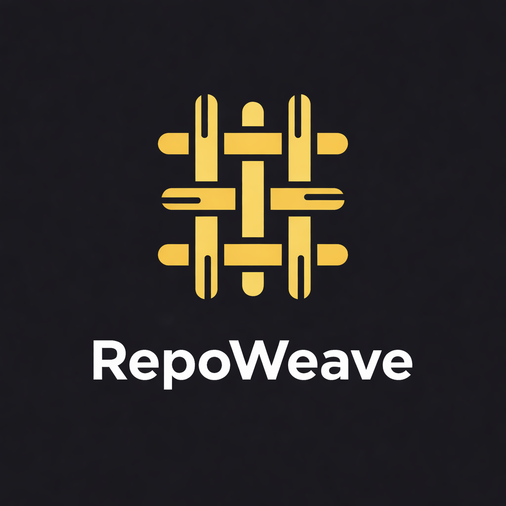
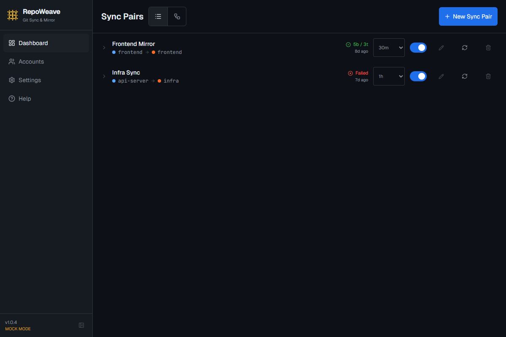
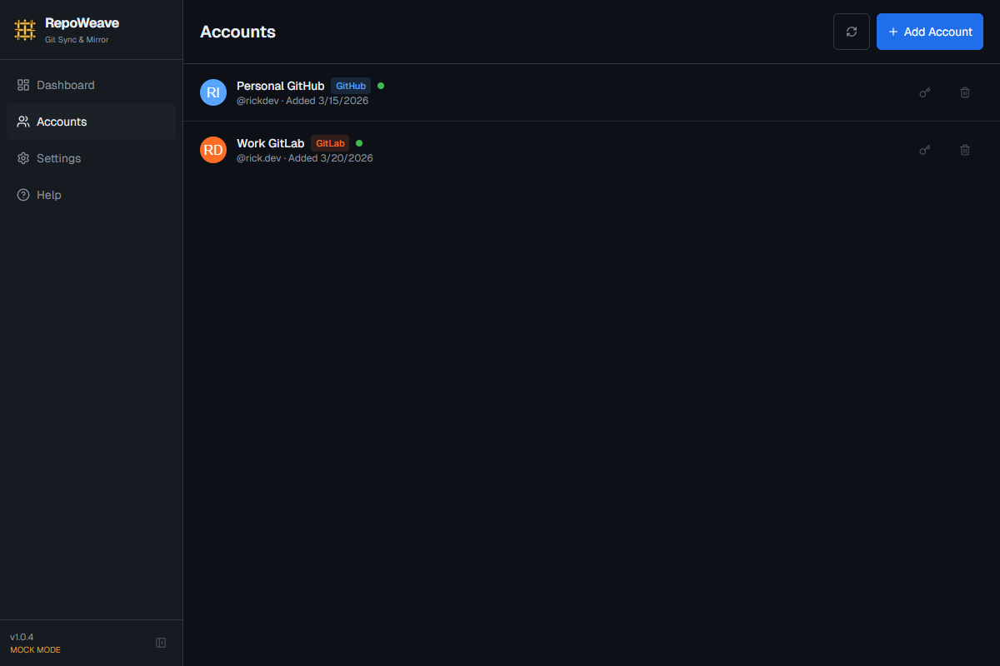
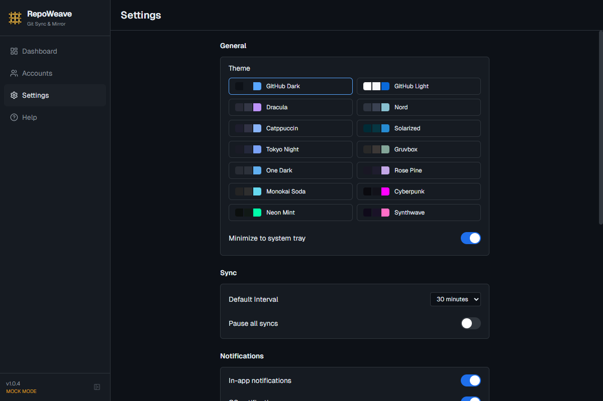
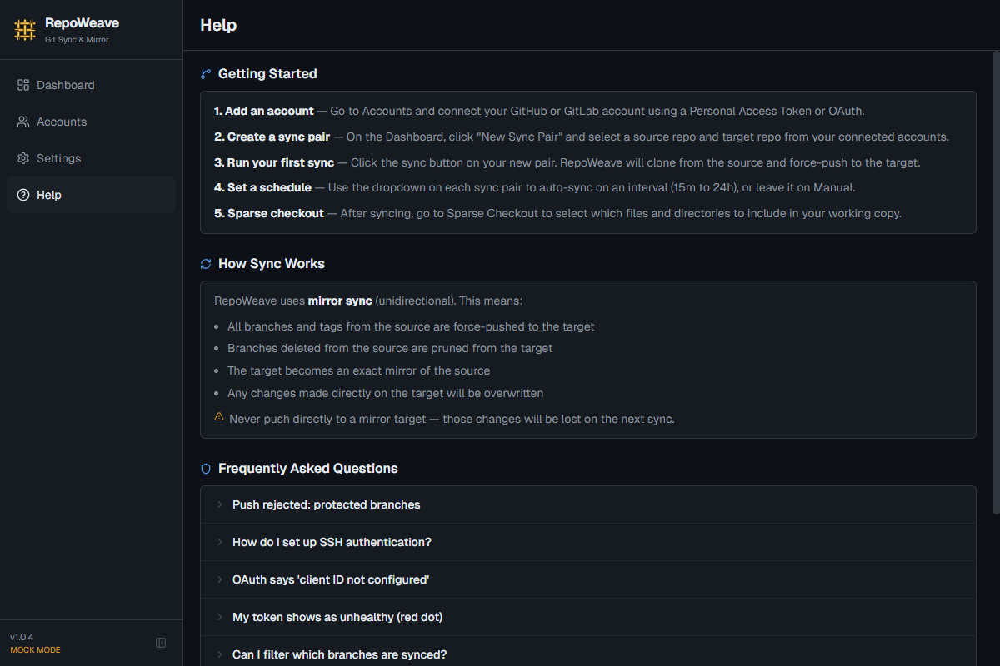

  

<h1 align="center">RepoWeave</h1>

  <strong>Mirror git repos between GitHub and GitLab — automatically.</strong>

  <a href="https://github.com/krunk404/RepoWeave-app/releases/latest">Download</a>

---

RepoWeave is a desktop app that keeps repositories in sync across providers. Point it at a source repo and a target repo, and it mirrors branches and tags via force-push on a schedule you choose. It runs in the background, sits in your system tray, and stays out of your way.

## Screenshots

| Dashboard | Accounts |
|:-:|:-:|
|  |  |

| Settings | Help |
|:-:|:-:|
|  |  |

## Features

- **Mirror sync** — Force-pushes all branches and tags from source to target. Prunes deleted branches automatically.
- **GitHub + GitLab** — Authenticate with Personal Access Tokens or OAuth. Supports self-hosted instances.
- **Scheduled syncs** — Set intervals from 15 minutes to 1 day, or sync manually.
- **Branch filtering** — Optionally limit which branches are synced.
- **Dry run** — Preview what would change before committing to a sync.
- **SSH key support** — Use passphrase-protected SSH keys for authentication.
- **Sparse checkout** — Select which files and directories to include in your working copy.
- **System tray** — Minimize to tray. Sync status at a glance. Context menu for quick actions.
- **14 themes** — GitHub Dark, Dracula, Nord, Catppuccin, Tokyo Night, Synthwave, and more.
- **Backup & restore** — Export/import your configuration as JSON.
- **Auto-updates** — Checks for new versions and installs them in-app.
- **Cross-platform** — Windows, macOS, and Linux.

## Install

Download the latest release for your platform:

| Platform | Format |
|----------|--------|
| Windows  | `.exe` (NSIS installer) |
| macOS    | `.dmg` / `.zip` |
| Linux    | `.AppImage` / `.deb` |

[**Download latest release**](https://github.com/krunk404/RepoWeave-app/releases/latest)

## Getting Started

1. **Add an account** — Go to Accounts and connect your GitHub or GitLab account using a Personal Access Token.
2. **Create a sync pair** — On the Dashboard, click "New Sync Pair" and select a source and target repo.
3. **Run your first sync** — Click the sync button. RepoWeave clones from the source and force-pushes to the target.
4. **Set a schedule** — Use the dropdown on each sync pair to auto-sync on an interval, or leave it on Manual.

## How Sync Works

RepoWeave uses **mirror sync** (unidirectional):

- All branches and tags from the source are force-pushed to the target
- Branches deleted on the source are pruned from the target
- The target becomes an exact mirror of the source
- Any changes pushed directly to the target will be overwritten on the next sync

> **Warning:** Never push directly to a mirror target — those changes will be lost.

## FAQ

**Push rejected: protected branches**
GitLab/GitHub can protect branches from force pushes. You need to allow force push for the branch in your provider's settings.

**My token shows as unhealthy (red dot)**
The token may have expired, been revoked, or lost required scopes. Delete the account and re-add it with a fresh token.

**Can I filter which branches are synced?**
Yes. Expand a sync pair on the Dashboard and enter a comma-separated list of branch names in the filter field. Tags are always synced.

## Tech Stack

- Electron
- React + TypeScript
- Tailwind CSS
- SQLite (better-sqlite3)
- dugite (git operations)

## License

MIT
